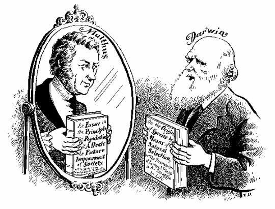

By the time when this book was published in 2004, developments of works on speciation can be divided into three phases:

1. 1859 - 1900s: *The Origin of Species* (Darwin, 1859). 
2. 1900s - 1980s
3. 1980s -

Darwin’s ideas on the origin of species were influenced by Malthus’s theory [1], particularly the notion that the disparity between the tendency for overpopulation and the limitation of available resources leads to famine and disease, which in turn reduce populations to sustainable levels. Darwin proposed that new species arise through natural selection acting on variation within overpopulating populations. However, this view appears to conflate two distinct processes: **adaptation**, where species evolve toward fitness peaks, and **speciation**, which involves the emergence of new reproductive barriers that give rise to distinct species.

